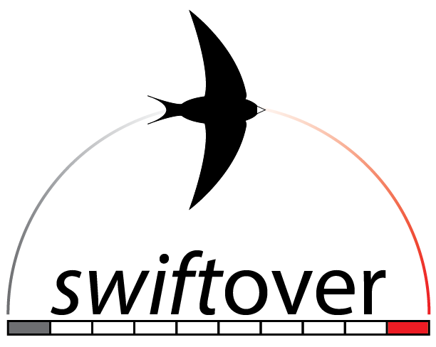

# Superfast Liftover

See our preprint here: pending

Please star our repo and cite our preprint/manuscript! It makes a big difference in grant applications.

## Background and Motivation

Our goal is to be at least as fast as Jim Kent's seminal "liftOver" tool.
We hypothesize that specifically for sorted genome intervals,
the implicit predictive caching of splay trees outperforms other
tree structures in linear/sequential search workloads as often found in genomics.
Indeed, splay trees outperform the well-balanced AVL tree,
which outperformed a slightly-less-well-balanced Red-Black tree.

 With the recent invention of Iplicit Interval Trees (IITrees)
 by Heng Li [1] and similar structures by others, we've tested these and found them
 to be even faster than splay trees in linear-scan liftover workloads.
 For strict liftover applications, IITrees are recommended.
 
 However, when nodes need to be added and removed (as we might need to when
 constructing graph genome structures) a traditional tree structure
 may be preferred due to the IITree's need to be entirely reindexed after each
 insert/delete operation. Future studies (i.e., benchmarks) are needed.

## Installation

Precompiled binaries are available on the releases page. These binaries are statically linked against htslib; a system installation of htslib is not required.

## Quickstart

`./swiftover -t bed -c chainfile.chain -i input.bed -u unmatched.bed > output.bed`

## Requirements

Chain file: Obtain from UCSC or Ensembl:

[http://hgdownload.cse.ucsc.edu/goldenpath/hg19/liftOver/](http://hgdownload.cse.ucsc.edu/goldenpath/hg19/liftOver/)

[ftp://ftp.ensembl.org/pub/assembly_mapping/](ftp://ftp.ensembl.org/pub/assembly_mapping/)

If you are working with human data, you can quickly grab hg19 to hg38
(UCSC-style contig naming: chr1, chrM) and GRCh37 to GRCh38
(Ensembl-style contig naming: 1, MT) by issuing `make chains`.
Chainfiles will be placed in `resources/`, and for the time being need to be un-gzipped.

Swiftover needs uncompressed chain files. TODO: Will add gzip reader.

## File Formats

It is critical that the contigs appearing in the _source_ file have an entry in the chain;
otherwise the program will terminate with `range violation`. Adding error checking/handling
for this is possible, but as the check would be run once for every row of input, it could
unnecessarily slow the liftover.

Likewise, in VCF mode, contig naming must be consistent across input VCF, chain file, and
destination genome.

### BED

All BED formats supported, including column 6 (strand) and columns 7-8 (thickStart/thickEnd).

*CAVEATS:* swiftover does not join intervals that are discontiguous
in the destination coordinates, whereas UCSC liftOver does by default. We feel that discontiguous intervals better represent to the user the relationship between source and destination sequence.

### VCF

VCF liftover works as you would expect. 😁

Keep in mind that contig names must be consistent among the chainfile, the genome, and the VCF.

Lifting a VCF file to a new genome build additionally requres a FASTA file of the new/destination genome. If it is not already faidx indexed, an index will be created automatically. If no .fai index already exists and swiftover does not have write permission to the directory containing the genome, execution will fail.

**Reference allele change:** Occasionally, the reference allele may differ even at equivalent coordinates in different genome builds. When swiftover detects this, it will update the REF column of the VCF record and add the tag **refchg** to the INFO column. These records can then be filtered by downstream tools if necessary (e.g., `bcftools view -i 'INFO/refchg=1'`)

An extra INFO column tag `refchg` is added when the reference allele changes between the
source and destination genomes.

*CAVEATS:* INFO and FORMAT column tags related to allele frequencies and calculations may
no longer be accurate in the destination geneome build (due to subtle mapping differences),
but _especially_ if the reference allele has changed. We will likely add cmdline flag to strip
all INFO/FORMAT tags, followed later by a plugin to recalculate select values (e.g. when refchg).

## Compiling from source

With dub, the configurations `avltree`, `splaytree`, and `iitree` are available. Currently, they
are in order of execution time iitree < splaytree < avltree.

DMD codegen can be poor compared to LDC and GDC, with execution too slow to compete with `liftover`.
Use LDC2 and `dub -b=release` for > 100% speedup. Additionally, as of dklib 0.1.1, DMD cannot inline
(at least) one of the functions in khash, which means compilation of swiftover with LDC2 or GDC is required.

**htslib:** when using LDC2, or when using the GOLD linker (instead of traditional GNU ld), you'll need to make sure
that the linker can find libhts, which is often installed in `/usr/local/lib`. GOLD does not search there
by default, nor does it examine `LD_LIBRARY_PATH`. It does, however, search `LIBRARY_PATH`, so add
`export LIBRARY_PATH=/usr/local/lib` (or wherever you have installed htslib) to build scripts or run before dub build.

thanks to [http://jbohren.com/articles/2013-10-28-gold/](http://jbohren.com/articles/2013-10-28-gold/)

## BUGS

2019-08-20 For VCF, INFO and FORMAT columns related to allele frequencies and calculations
may no longer be accurate in the destination genome build due to subtle mapping differences
but _especially_ if the reference allele has changed. Look for the `refchg` tag on those rows.

## References

[1] https://github.com/lh3/cgranges
